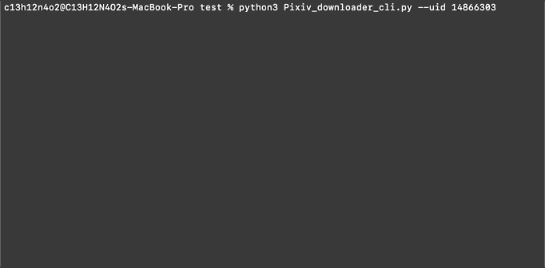

# Pixiv Crawler API

> Pixiv Crawler API

## Example Program


## Getting started

To start making a pixiv image downloader with Pixiv Crawler API, initialize an object.

```
import Pixiv_crawler

pixiv = Pixiv_Crawler.Pixiv()
```

There are only two ways to log into Pixiv. One is by logging in with your pixiv id and password.

```
pixiv.login('pixiv_id', 'password')
```

And another is with a refresh token.

```
pixiv.login('refreshtoken')
```

## APIs

### parse_url(url, mode, headers, data, params, stream)

```
Parameters  url(str)  - The url to the Pixiv pages or file.
            mode(str) - The request mode. Supports get, post and delete.
            headers   - The user-agent and referer headers. 
            params    - The url parameters.
            stream    - If false, the response content will be immediately downloaded.
```
              
### login(pixiv_id, password, refresh_token)

```
Parameters  pixiv_id(str)      - The Pixiv account.
            password(str)      - The Pixiv password.
            refresh_token(str) - The Pixiv refresh_token 
```

### user_detail(user_id, filter)

```
Parameters  user_id(str)  - The Pixiv user ID.
            filter        - The page filter.
```

### user_illust(user_id, type, tags, restrict, filter, offset, is_pc)

```
Parameters  user_id(str)  - The Pixiv user ID.
            type(str)     - The type of content [Illust, Manga, Ugoira, Novel]
            tags(str)     - The content tags.
            restrict      - If false, the page will show mature contents.
            filter        - The page filter.
            offset        - The page offset.
```

### user_bookmark_illust(user_id, restrict, filter, offset)

```
Parameters  user_id(str)  - The Pixiv user ID.
            restrict      - If false, the page will show mature contents.
            filter        - The page filter.
            offset        - The page offset.
```

### user_following(user_id, restrict, filter, offset)

```
Parameters  user_id(str)  - The Pixiv user ID.
            restrict      - If false, the page will show mature contents.
            filter        - The page filter.
            offset        - The page offset.
```

### user_mypixiv(user_id, restrict, filter, offset)

```
Parameters  user_id(str)  - The Pixiv user ID.
            restrict      - If false, the page will show mature contents.
            filter        - The page filter.
            offset        - The page offset.
```

### illust_detail(illust_id, is_pc)

```
Parameters  illust_id(str)  - The Pixiv illust ID.
            is_pc           - If true, the page is PC-based.
```

### illust_pages(illust_id)

```
Parameters  illust_id(str)  - The Pixiv illust ID.
```

### illust_comments(illust_id, include_total_comments, offset)

```
Parameters  illust_id(str)         - The Pixiv illust ID.
            include_total_comments - If true, the page will show total comments on this page.
            offset                 - The page offset.
```

### illust_recommended(illust_id, filter, min_bookmark_id_for_recent_illust, max_bookmark_id_for_recommend, offset, include_ranking_illusts, include_privacy_policy)
        
### illust_ranking(mode, content, index, filter, date, offset, is_pc)
        
### trending_tags_illust(filter)

### search_illust(word, include_translated_tag_results, merge_plain_keyword_results, filter search_target, sort, duration, start_date, end_date, offset)

### search_user(word, filter, sort, duration, offset)
        
### ugoira_metadata(illust_id, is_pc)

### illust_follow(restrict, filter)
        
### illust_related(illust_id, filter, seed_illust_ids, offset)

### illust_bookmark_detail(illust_id, filter)
        
### illust_bookmark_add(illust_id, restrict, tags)

### illust_bookmark_delete(illust_id)
        
### illust_bookmark_detail(illust_id)

### illust_bookmark_users(illust_id)

### user_follow(user_id, restrict)
        
### user_unfollow(user_id, restrict)

### user_follow_detail(user_id)

### spotlight_articles(offset)
        
### emoji()

### user_list(user_id, filter, offset)
        
### illust_new(max_illust_id)
        
### illust_series(illust_series_id)

### download(url, delay)


